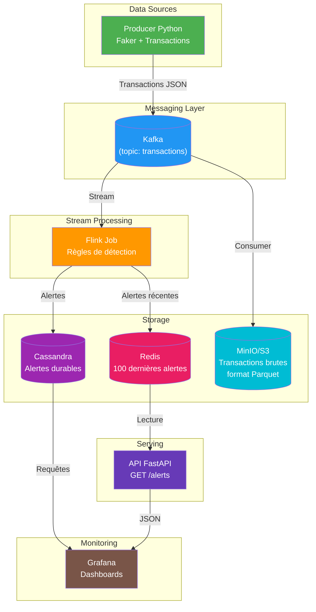

# Architecture — Détection de Fraude Temps Réel

## Flux des données

1. **Producer** génère des transactions financières (95% normales, 5% frauduleuses)
2. **Kafka** reçoit et bufferise les transactions
3. **Flink** (prochaine étape) lit les transactions en streaming et applique les règles
4. **Cassandra** stocke les alertes de façon durable
5. **Redis** garde les 100 dernières alertes pour l'API temps réel
6. **MinIO** archive toutes les transactions brutes en Parquet pour rejeu et training ML
7. **FastAPI** sert les alertes via une API REST
8. **Grafana** visualise les métriques en temps réel

## Ports

| Service       | Port |
| ------------- | ---- |
| Kafka         | 9092 |
| Cassandra     | 9042 |
| Redis         | 6379 |
| MinIO API     | 9002 |
| MinIO Console | 9003 |
| Grafana       | 3001 |
